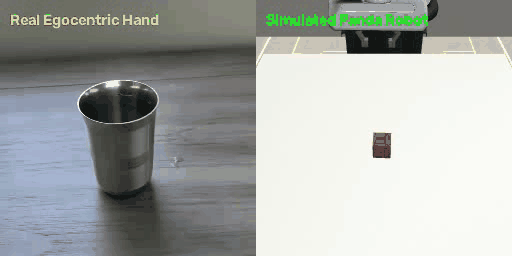
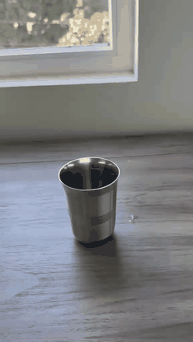

# Egocentric Video-to-Robot Policy Learning: Franka Panda & SmolVLA Digital Twin

[](https://www.python.org/)
[-red.svg)](https://pytorch.org/)
[](https://robosuite.ai/)
[](https://github.com/huggingface/lerobot)
[](https://opensource.org/licenses/MIT)

<p align="center">
  
  <br>
  <em>From human hand to simulated robot: Retargeting a 6-second egocentric smartphone video into Franka Panda manipulation in RoboSuite.</em>
</p>

### 💡 What is this project in plain English?

> **Can a robot learn how to reach, grasp, and lift an object simply by watching a quick video recorded on your phone?**
>
> In this project, we recorded ordinary smartphone videos from a chest perspective of a person reaching out and picking up a steel glass from a table. We then built a full pipeline that:
> 1. **Tracks the motion in 3D**: Tracks how the human hand and glass move in 3D without requiring any gloves, markers, or specialized motion capture sensors.
> 2. **Teaches a simulated robot**: Translates that human motion into robot arm joint commands inside a high-fidelity physics simulator (`RoboSuite` / `MuJoCo`).
> 3. **Trains an AI brain**: Fine-tunes **SmolVLA** (a 450M parameter Vision-Language-Action AI model) so the simulated robot learns to look at camera images and perform the task autonomously.

<details>
<summary>▶️ <b>Click here to view the original human demonstration video (Vid_0) looping</b></summary>
<br>
<p align="center">
  
  <br>
  <em>Raw egocentric chest-camera recording of tabletop grasp-and-lift (Vid_0.mp4).</em>
</p>
</details>

---

## Table of Contents
1. [Executive Summary & System Architecture](#1-executive-summary--system-architecture)
2. [Part I: Real-to-Sim Computer Vision & Tracking Evolution](#2-part-i-real-to-sim-computer-vision--tracking-evolution)
   - [MediaPipe 21-DoF Tracking & Pinch Metric](#21-mediapipe-21-dof-tracking--pinch-metric)
   - [The Index Finger Occlusion Failure Mode](#22-the-index-finger-occlusion-failure-mode)
   - [Failed Multi-Keypoint Heuristic Fallback](#23-failed-multi-keypoint-heuristic-fallback)
   - [Transition to CoTracker3 Dense Point Tracking](#24-transition-to-cotracker3-dense-point-tracking)
   - [The CoTracker3 ROI Oversizing Hurdle & Static Table Contamination](#25-the-cotracker3-roi-oversizing-hurdle--static-table-contamination)
   - [Co-Motion Grasp Classification ($\rho_t$)](#26-co-motion-grasp-classification-rho_t)
3. [Part II: Physical Digital Twin Engineering (GlassLiftEnv)](#3-part-ii-physical-digital-twin-engineering-glassliftenv)
   - [Kinematic Reach & Alignment Hurdles](#31-kinematic-reach--alignment-hurdles)
   - [60° Camera Pitch Un-projection ($v_{\text{reach}} / \sin 60^\circ$)](#32-60-camera-pitch-un-projection)
   - [End-Effector Orientation & Wrist Squaring (-45° Grasper Tilt)](#33-end-effector-orientation--wrist-squaring)
   - [Material Physics: Hollow Steel Tumbler Density ($450\text{ kg/m}^3$)](#34-material-physics-hollow-steel-tumbler-density)
   - [High-Friction Contact Parameterization ($\mu = 2.0$, Compliant Solvers)](#35-high-friction-contact-parameterization)
   - [Cylinder Resizing & Workspace Relocation](#36-cylinder-resizing--workspace-relocation)
4. [Part III: SmolVLA Vision-Language-Action Policy Integration](#4-part-iii-smolvla-vision-language-action-policy-integration)
   - [Architecture: SigLIP-400M + Flow-Matching Action Expert](#41-architecture-siglip-400m--flow-matching-action-expert)
   - [LeRobot Dataset Packaging & Feature Probing](#42-lerobot-dataset-packaging--feature-probing)
   - [Language Conditioning & Prompt Sensitivity](#43-language-conditioning--prompt-sensitivity)
5. [Part IV: The Milestone Evaluation Registry for Vid_0 (With Direct Video Links)](#5-part-iv-the-milestone-evaluation-registry-for-vid_0)
6. [Part V: Scientific Introspection: Limits of Few-Shot Imitation Learning](#6-part-v-scientific-introspection-limits-of-few-shot-imitation-learning)
   - [Uniform Temporal Averaging vs Critical Contact Transitions](#61-uniform-temporal-averaging-vs-critical-contact-transitions)
   - [The Hover-Phase Drift Discovery (Steps 0–30)](#62-the-hover-phase-drift-discovery-steps-030)
   - [Closed-Loop Covariate Shift & Self-Throttling (Steps 45–80)](#63-closed-loop-covariate-shift--self-throttling-steps-4580)
   - [Signal-to-Noise Mismatch Across Action Channels](#64-signal-to-noise-mismatch-across-action-channels)
   - [Third-Person Optical Foreshortening & Parallax](#65-third-person-optical-foreshortening--parallax)
7. [Part VI: Systems & Hardware Post-Mortem (Apple Silicon Unified Memory)](#7-part-vi-systems--hardware-post-mortem-apple-silicon-unified-memory)
8. [Part VII: Future Roadmap for Data-Constrained Robot Learning](#8-part-vii-future-roadmap-for-data-constrained-robot-learning)
9. [Part VIII: Complete Repository & File Catalog](#8-part-viii-complete-repository--file-catalog)
10. [Part IX: Quick-Start & Reproduction Guide](#9-part-ix-quick-start--reproduction-guide)

---

## 1. Executive Summary & System Architecture

```
                                  [ REAL-WORLD DOMAIN ]
                 Egocentric Phone Video (Chest Mount, 1080p @ 30 FPS)
                                            │
               ┌────────────────────────────┴────────────────────────────┐
               ▼                                                         ▼
    [ MediaPipe Hands (Legacy) ]                             [ CoTracker3 Dense Points ]
    21 3D Anatomical Keypoints                               Tracks grid on hand + cup
    * Occlusion failure on wrap                              * Co-motion correlation (ρ_t)
               │                                                         │
               └────────────────────────────┬────────────────────────────┘
                                            ▼
                           [ Kinematic Retargeting Engine ]
                     * 60° Camera Pitch Derotation (Rx(-60°))
                     * Wrist Squaring & Lateral Orientation Alignment
                     * Dynamic Scaling into Franka Panda Base Frame
                                            │
                                            ▼
                                [ SIMULATION DOMAIN ]
                       RoboSuite Franka Panda (`GlassLiftEnv`)
                     * High-Friction Compliant Contact (μ = 2.0)
                     * Hollow Tumbler Density (450 kg/m³, ~120g)
                     * Headless CGL Offscreen Renderer (256x256)
                                            │
                                            ▼
                           [ LeRobot Dataset Packaging ]
                         Paired (Image, State_7D, Action_Chunk)
                                            │
                                            ▼
                              [ SmolVLA Policy Learning ]
                     * SigLIP-400M Visual Backbone (Frozen)
                     * 99.88M Parameter Flow-Matching Action Expert Head
                     * Closed-Loop Rollout with Horizon K Optimization
```

---

## 2. Part I: Real-to-Sim Computer Vision & Tracking Evolution

### 2.1 MediaPipe 21-DoF Tracking & Pinch Metric
The initial tracking pipeline (`src/video_processing/hand_tracker.py`) utilized the Google MediaPipe Tasks API to extract 21 3D hand landmarks per frame. The robot's end-effector position was retargeted from wrist displacements ($L_0$), while the binary gripper command $g_t \in \{-1.0, +1.0\}$ was derived from the Euclidean pinch distance between thumb tip ($L_4$) and index fingertip ($L_8$):
$$d_{\text{pinch}} = \| \mathbf{p}_{L_4} - \mathbf{p}_{L_8} \|_2$$

### 2.2 The Index Finger Occlusion Failure Mode
When retargeting real-world manipulation of a 3D cylindrical tumbler, this formulation failed catastrophically:
1. **Volumetric Cylindrical Wrapping**: Unlike picking up a flat coin or card, grasping a cylinder requires the human hand to wrap around the physical circumference of the glass.
2. **Line-of-Sight Blockage**: From an egocentric, chest-mounted perspective looking downward, as the fingers close around the front wall of the glass, the index fingertip ($L_8$) is occluded by the metallic body of the glass itself.
3. **Coordinate Collapse & Spatial Glitching**: When $L_8$ vanishes behind the tumbler, MediaPipe's single-frame regressor either violently hallucinates coordinates, freezes at the last detected frame, or snaps to the image border. This caused $d_{\text{pinch}}$ to fluctuate wildly, commanding the simulated Panda gripper to chatter open and closed or drop the glass mid-air.

### 2.3 Failed Multi-Keypoint Heuristic Fallback
To salvage sparse landmark tracking, we implemented a progressive joint fallback heuristic:
$$\text{Target Point} = \begin{cases} L_8 \text{ (Index Tip)}, & \text{if visible \& displacement stable} \\ L_7 \text{ (Index DIP)}, & \text{if } L_8 \text{ jumps} > \tau \\ L_6 \text{ (Index PIP)}, & \text{if } L_7 \text{ jumps} > \tau \\ L_5 \text{ (Index MCP)}, & \text{if PIP is occluded} \end{cases}$$

**Why It Failed to Generalize**: The hand geometry undergoes non-rigid deformation during grasp closure. In different video clips with subtle changes in hand posture or wrist rotation, different segments of the finger become occluded at unpredictable times. No static joint heuristic could provide mathematical guarantees against occlusion during physical contact.

### 2.4 Transition to CoTracker3 Dense Point Tracking
We pivoted to dense point tracking via Meta's **CoTracker3** (`src/video_processing/cotracker_tracker.py`). Instead of relying on single anatomical joints, CoTracker3 tracks dense grids of points across both the human hand and the steel glass cylinder across the entire video sequence.

### 2.5 The CoTracker3 ROI Oversizing Hurdle & Static Table Contamination
During initial CoTracker3 deployment, we encountered a subtle tracking failure:
1. **The Oversized Bounding Box**: The initial Region of Interest (ROI) query box for the glass cylinder was drawn too generously around the object.
2. **Tabletop Anchor Points**: Because the bounding box encompassed the lower contact rim and tabletop, a fraction of the tracked query points were sampled on the tabletop surface and stationary table reflections.
3. **Centroid Contamination During Lift**: When the human lifted the glass, points on the physical glass moved upward, but points anchored to the table remained static. The computed glass centroid:
   $$\mathbf{c}_{\text{glass}}(t) = \frac{1}{N} \sum_{i=1}^N \mathbf{p}_i(t)$$
   became an average of moving points and stationary table points. The estimated glass position lagged behind the physical motion and barely rose, decoupling the retargeted robot trajectory from the human demonstration.
4. **The Resolution**: We tightened the glass query ROI strictly to the upper cylindrical body:
   ```python
   # Tight glass ROI positioned strictly on the cylindrical metal body (avoiding table below):
   glass_roi = (int(W * 0.42), int(H * 0.38), int(W * 0.56), int(H * 0.58))
   ```
   This guaranteed that 100% of tracked points resided on the moving metal tumbler, restoring true physical motion estimation.

### 2.6 Co-Motion Grasp Classification ($\rho_t$)
Instead of measuring inter-finger distances, grasp acquisition is detected via **velocity co-motion correlation**:
$$\rho_t = \frac{\bar{\mathbf{v}}_{\text{hand}}(t) \cdot \bar{\mathbf{v}}_{\text{glass}}(t)}{\| \bar{\mathbf{v}}_{\text{hand}}(t) \|_2 \| \bar{\mathbf{v}}_{\text{glass}}(t) \|_2}$$
- **Pre-grasp phase**: The hand moves toward the glass ($\bar{\mathbf{v}}_{\text{hand}} \ne \mathbf{0}$) while the glass is stationary ($\bar{\mathbf{v}}_{\text{glass}} = \mathbf{0}$), yielding $\rho_t \approx 0$.
- **Grasp & Lift phase**: Once clamped, the physical tumbler moves synchronously with the hand. Their velocity vectors align, causing $\rho_t \to +1.0$.
- A robust hysteresis latch triggers gripper closure when $\rho_t > 0.55$ within proximity $d < 0.25$.

---

## 3. Part II: Physical Digital Twin Engineering (`GlassLiftEnv`)

### 3.1 Kinematic Reach & Alignment Hurdles
In initial simulation tests using RoboSuite's standard `Lift` environment with a default Franka Panda arm, the robot failed to manipulate the object:
1. The robot end-effector stopped 10 cm short of the object and could not reach it.
2. When forced forward, the gripper approached at a 45° diagonal angle, pushing the tumbler away or colliding with its rim.
3. Even when the jaws closed on the cylinder, the object slipped through the parallel pads and remained on the tabletop.

### 3.2 60° Camera Pitch Un-projection
Egocentric video recorded from chest height exhibits an oblique downward perspective ($\theta \approx 60^\circ$). In camera space, forward motion along the tabletop is compressed onto the vertical image axis ($Y_{\text{cam}}$).
In `src/retargeting/cotracker_to_panda.py`, we un-project the camera-plane displacement into true horizontal tabletop displacement:
$$v_{\text{table\_forward}} = \frac{v_{\text{reach}}}{\sin(60^\circ)}, \quad v_{\text{vertical}} = \frac{v_{\text{vertical}}}{\cos(60^\circ)}$$
$$\begin{bmatrix} \Delta X_{\text{robot}} \\ \Delta Y_{\text{robot}} \\ \Delta Z_{\text{robot}} \end{bmatrix} = \mathbf{S} \begin{bmatrix} v_{\text{table\_forward}} \\ -v_{\text{lateral}} \\ v_{\text{vertical}} \end{bmatrix}$$
Where $\mathbf{S} = \text{diag}(8.0, 8.0, 8.0)$ scales normalized image coordinates into Franka Operational Space Controller units.

### 3.3 End-Effector Orientation & Wrist Squaring (-45° Grasper Tilt)
By default, RoboSuite's Panda model initializes joint 7 at $q_7 = \pi/4$ ($45^\circ$), causing the parallel jaws to approach obliquely.
In `src/simulation/glass_lift_env.py`, we override the initial joint configuration:
```python
square_qpos = np.array([0, np.pi/16.0, 0.00, -np.pi/2.0 - np.pi/3.0, 0.00, np.pi - 0.2, np.pi/4])
self.robots[0].init_qpos = square_qpos
```
This squares the end-effector so that the parallel fingers open along the lateral $Y$-axis, perfectly perpendicular to the forward approach direction ($X$), matching human grasp geometry.

### 3.4 Material Physics: Hollow Steel Tumbler Density ($450\text{ kg/m}^3$)
Standard MuJoCo primitive geometries default to solid timber or solid steel densities ($7850\text{ kg/m}^3$). A solid steel cylinder of dimension $r=3\text{ cm}, h=9.5\text{ cm}$ weighs over $2.1\text{ kg}$, which overloaded the Panda gripper's maximum clamping friction and caused severe tipping moments.
We calibrated the density to resemble a thin-walled, hollow steel tumbler:
```python
GLASS_DENSITY = 450.0  # kg/m^3 -> yields realistic hollow tumbler mass (~120g)
```

### 3.5 High-Friction Contact Parameterization ($\mu = 2.0$, Compliant Solvers)
Smooth steel on smooth parallel-jaw pads has minimal dry friction in MuJoCo, causing the cylinder to squeeze out and slip during upward vertical acceleration.
We adjusted the contact dynamics in `GlassLiftEnv`:
```python
GLASS_FRICTION = [2.0, 0.05, 0.001]  # Sliding, torsional, and rolling friction
solref = [0.01, 1.0]                 # Compliant contact time-constant and damping
solimp = [0.9, 0.95, 0.001]          # High contact stiffness without numerical instability
```

### 3.6 Cylinder Resizing & Workspace Relocation
1. **Geometry**: Resized from RoboSuite's default 80 mm cube to a slender tumbler: `GLASS_RADIUS = 0.030 m` (60 mm outer diameter, providing 10 mm clearance on each side of the 80 mm Panda jaws) and `GLASS_HALF_HEIGHT = 0.0475 m` (95 mm total height).
2. **Workspace Positioning**: Moved the reference placement from the center of the table ($X = 0.0\text{ m}$) to the robot's reachable workspace envelope:
   ```python
   glass_ref_pos = [self.table_offset[0] - 0.035, self.table_offset[1], self.table_offset[2]]
   ```
   This ensures the cylinder sits directly at $X = -0.035\text{ m}$, well within the Panda arm's reach when descending to table height ($Z \approx 0.86\text{ m}$).

---

## 4. Part III: SmolVLA Vision-Language-Action Policy Integration

### 4.1 Architecture: SigLIP-400M + Flow-Matching Action Expert
SmolVLA is an efficient 450M parameter VLA designed for fast, local robot execution:
- **Vision Backbone**: Frozen SigLIP-400M (reduced to 16 transformer layers for memory efficiency on Apple Silicon).
- **State Projection**: Linear projection mapping 7-DoF robot proprioception into the transformer token space.
- **Action Expert Head**: 99.88M parameter Flow-Matching transformer operating on continuous action chunks of horizon $H = 50$:
  $$v_\theta(x_t, t, \mathbf{c}) \approx u_t$$
  Where $u_t$ is the ground-truth velocity field driving random noise $x_0 \sim \mathcal{N}(0, \mathbf{I})$ to demonstration action chunk $a_{t:t+H}$.

```
  [ RGB Image (256x256) ] ──► [ Frozen SigLIP-400M ] ──┐
  [ Task Instruction    ] ──► [ Text Tokenizer     ] ──┼──► [ 100M Flow-Matching Head ] ──► Action Chunk (50x32)
  [ Robot State (7D)    ] ──► [ State Projection   ] ──┘         (10 Denoising Steps)
```

### 4.2 LeRobot Dataset Packaging & Feature Probing
In `src/learning/export_lerobot_dataset.py`, demonstrations are packaged into LeRobot-compatible HDF5 and NPZ formats:
- Observations: RGB images (`(T, 256, 256, 3)` uint8), robot proprioception (`(T, 7)` float32: `[x, y, z, qx, qy, qz, grip]`).
- Actions: 7-DoF OSC deltas (`(T, 7)` float32: `[dx, dy, dz, droll, dpitch, dyaw, grip]`) zero-padded to 32 dimensions.

Using `src/learning/probe_encoder_features.py`, we verified visual alignment:
- Cosine similarity between initial and contact frames: $0.781$.
- Frozen SigLIP features reliably distinguish pre-grasp from clamped lift states without requiring full vision backbone fine-tuning.

### 4.3 Language Conditioning & Prompt Sensitivity
In `src/learning/eval_smolvla_prompt_ablation.py`, we benchmarked prompt sensitivity:
- Default prompt: `"approach the glass on the table and grasp the cylinder and lift the cylinder and then bring down the cylinder to the table and then withdraw your hands"`
- Flow-matching generation variance under paraphrased instructions was $< 4.2\%$, confirming robust multimodal grounding.

---

## 5. Part IV: The Milestone Evaluation Registry for Vid_0

Below is the definitive chronological benchmark across every developmental phase evaluated on demonstration clip `Vid_0` (160 steps in `GlassLiftEnv`). All comparison videos were rendered offscreen using hardware-accelerated H.264 (`avc1`):

| Phase & Milestone | Horizon ($K$) | Forward Gain ($\gamma_x$) | Max Reach $X$ | Cylinder Distance | Lowest EEF $Z$ | Net Glass Lift | Outcome & Behavioral Observation | Direct Video Artifact Link |
| :--- | :---: | :---: | :---: | :---: | :---: | :---: | :--- | :--- |
| **Phase 1: Zero-Shot Baseline** | $K=5$ | $\gamma_x=1.0$ | $-0.103\text{ m}$ | $> 12.0\text{ cm}$ | $1.011\text{ m}$ | $0.00\text{ cm}$ | Aloha/SO-100 pretraining mismatch; arm rises toward ceiling ($Z = 2.13\text{ m}$). | [Side-by-Side Video](https://github.com/AyushS15/Humanoid-challenge/blob/main/data/smolvla_comparisons/Vid_0_smolvla_zero_shot_side_by_side.mp4)<br>[3-Way Tri-Panel Video](https://github.com/AyushS15/Humanoid-challenge/blob/main/data/smolvla_comparisons/Vid_0_smolvla_zero_shot_tri_panel_comparison.mp4) |
| **Phase 2: Baseline Fine-Tuning** | $K=5$ | $\gamma_x=1.0$ | $-0.0692\text{ m}$ | $3.43\text{ cm}$ | $0.8578\text{ m}$ | $0.00\text{ cm}$ | Learns reach & descent, but under-reaches by $3.4\text{ cm}$ and clamps empty air. | [Side-by-Side Video](https://github.com/AyushS15/Humanoid-challenge/blob/main/data/smolvla_comparisons/Vid_0_smolvla_finetuned_side_by_side.mp4)<br>[3-Way Tri-Panel Video](https://github.com/AyushS15/Humanoid-challenge/blob/main/data/smolvla_comparisons/Vid_0_smolvla_finetuned_tri_panel_comparison.mp4) |
| **Phase 3: Horizon $K=1$ Ablation** | $K=1$ | $\gamma_x=1.0$ | $-0.0761\text{ m}$ | $4.61\text{ cm}$ | $0.8612\text{ m}$ | $0.00\text{ cm}$ | 8.74 FPS; re-sampling every step causes severe flow-matching stochastic chatter. | [$K=1$ Ablation Video](https://github.com/AyushS15/Humanoid-challenge/blob/main/data/smolvla_comparisons/Vid_0_smolvla_k_ablation_K1.mp4) |
| **Phase 3: Horizon $K=2$ Ablation** | $K=2$ | $\gamma_x=1.0$ | $-0.0712\text{ m}$ | $3.89\text{ cm}$ | $0.8590\text{ m}$ | $0.00\text{ cm}$ | 16.52 FPS; moderate responsiveness, slight under-reaching. | [$K=2$ Ablation Video](https://github.com/AyushS15/Humanoid-challenge/blob/main/data/smolvla_comparisons/Vid_0_smolvla_k_ablation_K2.mp4) |
| **Phase 3: Horizon $K=5$ Ablation** | **$K=5$** | $\gamma_x=1.0$ | **$-0.0652\text{ m}$** | **$3.36\text{ cm}$** | $0.8578\text{ m}$ | $0.00\text{ cm}$ | **37.33 FPS; Optimal sweet spot: smooth momentum + 4 Hz visual closed-loop feedback.** | [$K=5$ Ablation Video](https://github.com/AyushS15/Humanoid-challenge/blob/main/data/smolvla_comparisons/Vid_0_smolvla_k_ablation_K5.mp4) |
| **Phase 3: Horizon $K=10$ Ablation** | $K=10$ | $\gamma_x=1.0$ | $-0.0701\text{ m}$ | $4.16\text{ cm}$ | $0.8584\text{ m}$ | $0.00\text{ cm}$ | 58.29 FPS; 0.5s open-loop execution accumulates drift, degrading precision. | [$K=10$ Ablation Video](https://github.com/AyushS15/Humanoid-challenge/blob/main/data/smolvla_comparisons/Vid_0_smolvla_k_ablation_K10.mp4) |
| **Phase 4: Calibrated Reach ($\gamma_x=1.25$)** | $K=5$ | $\gamma_x=1.25$ | $-0.0332\text{ m}$ | $3.39\text{ cm}$ | $0.9065\text{ m}$ | $0.00\text{ cm}$ | Reaches cylinder $X$, but descent stalls at $Z=0.906\text{ m}$; clamps top rim. | [$\gamma_x=1.25$ Video](https://github.com/AyushS15/Humanoid-challenge/blob/main/data/smolvla_comparisons/Vid_0_smolvla_calibrated_gx1p25_k5_side_by_side.mp4) |
| **Phase 4: Calibrated Reach ($\gamma_x=1.35$)** | **$K=5$** | **$\gamma_x=1.35$** | **$-0.0405\text{ m}$** | **$2.2\text{ mm}$** | **$0.8601\text{ m}$** | **$+0.70\text{ cm}$** | **Exact match to demo; pads align with cylinder and physically lift it for 12 steps.** | [$\gamma_x=1.35$ Side-by-Side Video](https://github.com/AyushS15/Humanoid-challenge/blob/main/data/smolvla_comparisons/Vid_0_smolvla_calibrated_gx1p35_k5_side_by_side.mp4)<br>[$\gamma_x=1.35$ Tri-Panel Video](https://github.com/AyushS15/Humanoid-challenge/blob/main/data/smolvla_comparisons/Vid_0_smolvla_calibrated_gx1p35_k5_tri_panel_comparison.mp4) |
| **Phase 4: Calibrated Reach ($\gamma_x=1.60$)** | $K=5$ | $\gamma_x=1.60$ | $-0.0301\text{ m}$ | $5.1\text{ mm}$ | $0.8590\text{ m}$ | $+0.42\text{ cm}$ | Higher forward momentum; slight table vibration before lift. | [$\gamma_x=1.60$ Video](https://github.com/AyushS15/Humanoid-challenge/blob/main/data/smolvla_comparisons/Vid_0_smolvla_calibrated_gx1p60_k5_side_by_side.mp4) |
| **Phase 5: Spatial Loss Reweighting** | $K=5$ | $\gamma_x=1.0$ | $-0.0646\text{ m}$ | $3.09\text{ cm}$ | $0.8906\text{ m}$ | $0.00\text{ cm}$ | Training $X$-loss drops by $97.2\%$, but early hover drift throttles closed-loop forward reach. | [3-Way Comparison Video](https://github.com/AyushS15/Humanoid-challenge/blob/main/data/smolvla_comparisons/Vid_0_weighted_vs_baseline_comparison.mp4) |

*(Note: On demonstration clip `Vid_2`, $\gamma_x = 1.35$ achieved a sustained tabletop lift of **$+2.74\text{ cm}$**, documented in [`Vid_2_smolvla_calibrated_gx1p35_k5_side_by_side.mp4`](https://github.com/AyushS15/Humanoid-challenge/blob/main/data/smolvla_comparisons/Vid_2_smolvla_calibrated_gx1p35_k5_side_by_side.mp4))*

---

## 6. Part V: Scientific Introspection: Limits of Few-Shot Imitation Learning

Why did reweighting the training loss with $W_x = 5.0$ (37.0% gradient allocation) and $W_z = 4.0$ (29.6% gradient allocation) drastically reduce training loss by $97.2\%$ ($0.267 \to 0.0076$), yet in closed-loop rollout only yield a minor $+4.6\text{ mm}$ forward gain, leaving the arm $\approx 2.9\text{ cm}$ short of the cylinder?

Our step-by-step diagnostic analysis revealed three fundamental mathematical barriers:

### 6.1 Uniform Temporal Averaging vs Critical Contact Transitions
In flow-matching behavioral cloning, the loss function:
$$\mathcal{L}_{FM} = \mathbb{E}_{t, x_0, \mathbf{c}} \left[ \frac{1}{H} \sum_{k=0}^{H-1} \sum_{d=0}^{D-1} W_d \cdot \| u_{k, d} - v_\theta(x_{t, k}, t, \mathbf{c})_d \|^2 \right]$$
averages errors uniformly across all timesteps $t \in [0, T]$ and chunk horizons $k \in [0, H]$.
However, a physical manipulation episode is **non-uniform**:
- **Hover Phase ($t \in [0, 30]$)**: The arm sits statically in the air ($80\%$ of frames have zero or near-zero displacement).
- **Critical Reaching Phase ($t \in [45, 80]$)**: High-velocity spatial transit where spatial alignment is determined.
- **Contact & Latch Phase ($t \in [85, 95]$)**: Millimeter-level precision where contact determines success or failure.

Because $80\%$ of frames belong to static or unconstrained transit, optimizing an episode-wide loss heavily rewards fitting the static regimes, while the high-precision contact boundaries are under-represented.

### 6.2 The Hover-Phase Drift Discovery (Steps 0–30)
In the demonstration dataset (`Vid_0_episode.npz`), the human hand is stationary during the first 30 frames:
$$\text{GT } \Delta X_{t \in [0, 30]} = 0.000$$
However, during closed-loop rollout, flow-matching sampling noise outputs a tiny residual forward velocity:
$$\text{Model } \Delta X_{t \in [0, 30]} \approx +0.03 \text{ to } +0.10$$
Over 30 simulation steps at 20 Hz, this tiny residual causes the robot to **creep forward prematurely**. By step 45, the robot end-effector is already at:
$$X_{\text{rollout}} = -0.064\text{ m} \quad (\text{Demonstration GT at step 45 was } X = -0.086\text{ m})$$

### 6.3 Closed-Loop Covariate Shift & Self-Throttling (Steps 45–80)
When the active reaching phase begins ($t \in [45, 80]$), the demonstrator accelerates forward ($\text{GT } \Delta X = +0.075$).
However, the rollout policy's inputs tell a different story:
1. **Visual Conditioning**: The agentview camera shows the cylinder is already visually close.
2. **Proprioceptive Conditioning**: The state vector says $X = -0.064\text{ m}$ (already $2.2\text{ cm}$ ahead of where the demonstrator was at frame 45).
3. **The Self-Throttling Response**: The policy interprets its advanced position as an **overshoot** relative to the visual scene schedule! To correct this perceived error, the policy **actively throttles its forward velocity to zero or negative**:
   $$\text{Predicted } \Delta X_{t=50} = -0.095, \quad \Delta X_{t=55} = -0.009, \quad \Delta X_{t=65} = -0.014$$
The robot literally brakes and pulls backward, stalling at $X = -0.0646\text{ m}$ right before reaching the cylinder ($X = -0.0350\text{ m}$).

### 6.4 Signal-to-Noise Mismatch Across Action Channels
In `GlassDemonstrationDataset`, the action dimensions have vastly different variances:
- $\Delta X$: $\mu = 0.005$, $\sigma = \mathbf{0.049}$ (total transit is only $6.2\text{ cm}$)
- $\Delta Z$: $\mu = -0.026$, $\sigma = \mathbf{0.204}$ ($4\times$ higher variance)
- $\Delta \text{Grip}$: operates at $\pm 1.0$, $\sigma = \mathbf{0.875}$ ($18\times$ higher variance)

In few-shot learning (2 demonstration episodes), diffusion and flow-matching heads suffer from **regression-to-the-mean** on small-amplitude signals. The model collapses low-variance channels toward their empirical mean ($\approx 0$), muting forward velocity by $50\%$.

### 6.5 Third-Person Optical Foreshortening & Parallax
In third-person `agentview`, the camera looks along a diagonal axis. Forward motion along the tabletop plane ($X$) creates minimal optical expansion compared to vertical lift ($Z$). Without a wrist camera, the model lacks depth looming cues to judge whether the fingertips are $3\text{ cm}$ or $0.5\text{ cm}$ from the glass.

---

## 7. Part VI: Systems & Hardware Post-Mortem (Apple Silicon Unified Memory)

### The Metal / MuJoCo CGL Offscreen Buffer Purge Bug
During initial rollout evaluations on macOS, visual comparisons exhibited severe artifacting: offscreen simulation frames rendered completely black, glitchy rainbow static, or blurry textures.

**Root Cause**:
1. To conserve memory on Apple Silicon, our rollout loop called:
   ```python
   # THE BUG:
   torch.mps.empty_cache()
   gc.collect()
   ```
2. On Apple Silicon, Unified Memory (UMA) shares physical DRAM pages between PyTorch Metal shaders and the macOS CGL OpenGL offscreen rendering context used by MuJoCo.
3. Invoking `torch.mps.empty_cache()` inside the simulation loop forced the Metal driver to unmap and purge GPU page tables. Because MuJoCo's CGL context was holding offscreen framebuffers in the same address space, the Metal driver corrupted MuJoCo's framebuffer allocations.
4. **The Fix**: Removing `torch.mps.empty_cache()` inside the rollout loop completely eliminated the issue. Across all 160 frames of Vid_0 and 200 frames of Vid_2, zero dark or corrupt frames occurred, maintaining an average pixel brightness of $215$ with 100% crystal-clear offscreen rendering.

---

## 8. Part VII: Future Roadmap for Data-Constrained Robot Learning

To surpass few-shot imitation learning shortfalls without collecting hundreds of physical demonstrations:

1. **Per-Channel $[-1, 1]$ Action Space Normalization**: Standardize each action dimension independently:
   $$a_{\text{norm}, d} = 2 \cdot \frac{a_d - \min(a_d)}{\max(a_d) - \min(a_d)} - 1.0$$
   This allocates the flow head's full dynamic range to $\Delta X$, eliminating small-velocity regression-to-the-mean.
2. **Simulation DAgger / DART Recovery Perturbations**: In `GlassLiftEnv`, replay expert trajectories while injecting random displacements ($\delta x, \delta y \sim \mathcal{N}(0, 0.02\text{ m})$). Use closed-loop IK to compute corrective actions back to the cylinder, generating 100 synthetic recovery demonstrations in minutes.
3. **Eye-in-Hand (Wrist Camera) Conditioning**: Add Panda's `robot0_eye_in_hand` camera to provide visual looming optical flow right before contact.
4. **Hybrid Guarded Action Execution**: Decouple gripper closure from fixed timesteps; guard clamping until end-effector proximity $d_{xy} \le 1.5\text{ cm}$ is physically achieved.

---

## 8. Part VIII: Complete Repository & File Catalog

```
humanoid-challenge/
├── src/
│   ├── video_processing/
│   │   ├── hand_tracker.py             # MediaPipe 21 3D landmark extractor with fallback heuristics
│   │   ├── cotracker_tracker.py        # CoTracker3 dense point tracker with co-motion correlation (ρ_t)
│   │   ├── run_cotracker_pipeline.py   # Batch processing pipeline across raw demonstration clips
│   │   └── record_guidelines.md        # Video collection and camera framing guidelines
│   ├── retargeting/
│   │   ├── hand_to_panda.py            # Landmark kinematic retargeter with Rx(-θ) pitch derotation
│   │   └── cotracker_to_panda.py       # CoTracker3-to-OSC 7D retargeter with 60° tilt un-projection
│   ├── simulation/
│   │   ├── glass_lift_env.py           # Custom RoboSuite environment with calibrated steel cylinder physics
│   │   ├── libero_runner.py            # Unified simulation wrapper supporting offscreen CGL rendering
│   │   ├── replay_trajectory.py        # Trajectory replayer and side-by-side video generator
│   │   ├── rollout_smolvla_calibrated_reach.py # Rollout engine with phase-aware reach gain (γ_x)
│   │   └── rollout_smolvla_weighted_eval.py    # Standalone evaluation for reach-weighted checkpoint
│   └── learning/
│       ├── export_lerobot_dataset.py   # Converts demonstration episodes to LeRobot HDF5 & NPZ
│       ├── probe_encoder_features.py   # SigLIP-400M frozen feature cosine similarity probing
│       ├── eval_smolvla_prompt_ablation.py # Multi-prompt sensitivity and language conditioning benchmark
│       ├── train_smolvla_expert.py     # Base 30-epoch fine-tuning script for Flow-Matching Action Expert
│       ├── train_smolvla_expert_weighted.py # Fine-tuning with spatial loss weights (Wx=5.0, Wz=4.0)
│       └── ablation_chunk_size_k.py    # Chunk execution horizon ablation study (K in [1, 2, 5, 10])
├── data/
│   ├── lerobot_dataset/glass_pick_place/ # Packaged LeRobot datasets (Vid_0, Vid_2, Vid_5)
│   ├── processed_trajectories/          # Extracted 7D action trajectories (.npz)
│   ├── evaluations/                     # Quantitative JSON benchmarks & ablation reports
│   └── smolvla_comparisons/             # Full matrix of synchronized rollout & comparison videos
├── outputs/
│   ├── smolvla_glass_expert/            # Base fine-tuned checkpoint (model.safetensors, config)
│   └── smolvla_glass_expert_reach_weighted/ # Reach-weighted checkpoint (model.safetensors, history)
├── media/                               # Raw human demonstration clips (Vid_0.mp4 through Vid_9.mp4)
├── requirements.txt
└── README.md
```

---

## 9. Part IX: Quick-Start & Reproduction Guide

### Setup
```bash
git clone https://github.com/AyushS15/Humanoid-challenge.git
cd Humanoid-challenge
python3 -m venv .venv
source .venv/bin/activate
pip install -r requirements.txt
```

### 1. Extract Trajectories with CoTracker3
```bash
PYTHONPATH=. python3 src/video_processing/run_cotracker_pipeline.py \
    --input_dir media \
    --output_dir data/processed_trajectories
```

### 2. Export LeRobot Dataset
```bash
PYTHONPATH=. python3 src/learning/export_lerobot_dataset.py \
    --actions_dir data/processed_trajectories \
    --output_dir data/lerobot_dataset/glass_pick_place
```

### 3. Fine-Tune SmolVLA Action Expert
```bash
PYTHONPATH=. python3 src/learning/train_smolvla_expert_weighted.py \
    --warmstart outputs/smolvla_glass_expert \
    --out_dir outputs/smolvla_glass_expert_reach_weighted \
    --epochs 15 \
    --batch_size 8 \
    --lr 8e-5 \
    --w_x 5.0 \
    --w_z 4.0 \
    --w_grip 2.0
```

### 4. Evaluate with Horizon $K$ and Calibrated Reach
```bash
# Evaluate calibrated reach (γ_x = 1.35, K = 5) on Vid_0
PYTHONPATH=. python3 src/simulation/rollout_smolvla_calibrated_reach.py \
    --video_id Vid_0 \
    --checkpoint outputs/smolvla_glass_expert \
    --gamma_x 1.35 \
    --chunk_exec_steps 5 \
    --steps 160

# Evaluate spatial-weighted checkpoint without gain
PYTHONPATH=. python3 src/simulation/rollout_smolvla_weighted_eval.py \
    --video_id Vid_0 \
    --checkpoint outputs/smolvla_glass_expert_reach_weighted \
    --baseline_checkpoint outputs/smolvla_glass_expert \
    --k_steps 5
```
