# Egocentric Video-to-Robot Policy Learning: Franka Panda & SmolVLA Digital Twin

[](https://www.python.org/)
[-red.svg)](https://pytorch.org/)
[](https://robosuite.ai/)
[](https://github.com/huggingface/lerobot)
[](https://opensource.org/licenses/MIT)

<p align="center">
  
  <br>
  <em><b>The Real-World Input</b>: A 6-second egocentric smartphone video of a person reaching out and picking up a steel glass from a table (Vid_0.mp4).</em>
</p>

### 💡 What is this project in plain English?

> **Can a robot learn how to reach, grasp, and lift an object simply by watching a quick video recorded on your phone?**
>
> In this project, we recorded ordinary smartphone videos from a chest perspective of a person reaching out and picking up a steel glass from a table. We then built an end-to-end AI and robotics pipeline that:
> 1. **Tracks the motion in 3D**: Tracks how the human hand and glass move in 3D without requiring any gloves, markers, or specialized motion capture sensors.
> 2. **Teaches a simulated robot**: Translates that human motion into robot arm joint commands inside a high-fidelity physics simulator (`RoboSuite` / `MuJoCo`).
> 3. **Trains an AI brain**: Fine-tunes **SmolVLA** (a 450M parameter Vision-Language-Action AI model) so the simulated robot learns to look at camera images and perform the task autonomously.

---

## Table of Contents
1. [Executive Summary & System Architecture](#1-executive-summary--system-architecture)
2. [Part I: Real-to-Sim Computer Vision & Tracking Evolution](#2-part-i-real-to-sim-computer-vision--tracking-evolution)
   - [MediaPipe 21-DoF Tracking & Pinch Metric](#21-mediapipe-21-dof-tracking--pinch-metric)
   - [The Index Finger Occlusion Failure Mode](#22-the-index-finger-occlusion-failure-mode)
   - [Failed Multi-Keypoint Heuristic Fallback](#23-failed-multi-keypoint-heuristic-fallback)
   - [Transition to CoTracker3 Dense Point Tracking](#24-transition-to-cotracker3-dense-point-tracking)
3. [Part II: Physical Digital Twin Engineering & The 5 CoTracker Breakthroughs](#3-part-ii-physical-digital-twin-engineering--the-5-cotracker-breakthroughs)
   - [Breakthrough 1: Raw CoTracker3 Baseline (`copy`) — The Immobility Hurdle](#31-breakthrough-1-raw-cotracker3-baseline-copy--the-immobility-hurdle)
   - [Breakthrough 2: 60° Camera Pitch & Tight Glass ROI (`copy 2`) — Restoring Forward Reach](#32-breakthrough-2-60-camera-pitch--tight-glass-roi-copy-2--restoring-forward-reach)
   - [Breakthrough 3: Material Physics Calibration (`copy 3`) — Hollow Steel Density & Contact Friction](#33-breakthrough-3-material-physics-calibration-copy-3--hollow-steel-density--contact-friction)
   - [Breakthrough 4: Gripper Squaring (45° → 0°) & Action Synchronization (`copy 4`) — First Successful Lift](#34-breakthrough-4-gripper-squaring-45--0--action-synchronization-copy-4--first-successful-lift)
   - [Breakthrough 5: Generalized Co-Motion Latch (ρ_t > 0.55) (`final`) — Autonomous Pick & Place](#35-breakthrough-5-generalized-co-motion-latch-rho_t--055-final--autonomous-pick--place)
   - [Cylinder Resizing & Workspace Relocation](#36-cylinder-resizing--workspace-relocation)
4. [Part III: SmolVLA Vision-Language-Action Policy Integration](#4-part-iii-smolvla-vision-language-action-policy-integration)
   - [Architecture: SigLIP-400M + Flow-Matching Action Expert](#41-architecture-siglip-400m--flow-matching-action-expert)
   - [LeRobot Dataset Packaging & Feature Probing](#42-lerobot-dataset-packaging--feature-probing)
   - [Language Conditioning & Prompt Sensitivity](#43-language-conditioning--prompt-sensitivity)
5. [Part IV: The Milestone Evaluation Registry for Vid_0 (With Direct Video Links)](#5-part-iv-the-milestone-evaluation-registry-for-vid_0)
6. [Part V: Scientific Introspection: Limits of Few-Shot Imitation Learning](#6-part-v-scientific-introspection-limits-of-few-shot-imitation-learning)
   - [Uniform Temporal Averaging vs Critical Contact Transitions](#61-uniform-temporal-averaging-vs-critical-contact-transitions)
   - [The Hover-Phase Drift Discovery (Steps 0–30)](#62-the-hover-phase-drift-discovery-steps-030)
   - [Closed-Loop Covariate Shift & Self-Throttling (Steps 45–80)](#63-closed-loop-covariate-shift--self-throttling-steps-4580)
   - [Signal-to-Noise Mismatch Across Action Channels](#64-signal-to-noise-mismatch-across-action-channels)
   - [Third-Person Optical Foreshortening & Parallax](#65-third-person-optical-foreshortening--parallax)
7. [Part VI: Systems & Hardware Post-Mortem (Apple Silicon Unified Memory)](#7-part-vi-systems--hardware-post-mortem-apple-silicon-unified-memory)
8. [Part VII: Future Roadmap for Data-Constrained Robot Learning](#8-part-vii-future-roadmap-for-data-constrained-robot-learning)
9. [Part VIII: Complete Repository & File Catalog](#8-part-viii-complete-repository--file-catalog)
10. [Part IX: Quick-Start & Reproduction Guide](#9-part-ix-quick-start--reproduction-guide)

---

## 1. Executive Summary & System Architecture

```
                                  [ REAL-WORLD DOMAIN ]
                 Egocentric Phone Video (Chest Mount, 1080p @ 30 FPS)
                                            │
               ┌────────────────────────────┴────────────────────────────┐
               ▼                                                         ▼
    [ MediaPipe Hands (Legacy) ]                             [ CoTracker3 Dense Points ]
    21 3D Anatomical Keypoints                               Tracks grid on hand + cup
    * Occlusion failure on wrap                              * Co-motion correlation (ρ_t)
               │                                                         │
               └────────────────────────────┬────────────────────────────┘
                                            ▼
                           [ Kinematic Retargeting Engine ]
                     * 60° Camera Pitch Derotation (Rx(-60°))
                     * Wrist Squaring & Lateral Orientation Alignment
                     * Dynamic Scaling into Franka Panda Base Frame
                                            │
                                            ▼
                                [ SIMULATION DOMAIN ]
                       RoboSuite Franka Panda (`GlassLiftEnv`)
                     * High-Friction Compliant Contact (μ = 2.0)
                     * Hollow Tumbler Density (450 kg/m³, ~120g)
                     * Headless CGL Offscreen Renderer (256x256)
                                            │
                                            ▼
                           [ LeRobot Dataset Packaging ]
                         Paired (Image, State_7D, Action_Chunk)
                                            │
                                            ▼
                              [ SmolVLA Policy Learning ]
                     * SigLIP-400M Visual Backbone (Frozen)
                     * 99.88M Parameter Flow-Matching Action Expert Head
                     * Closed-Loop Rollout with Horizon K Optimization
```

---

## 2. Part I: Real-to-Sim Computer Vision & Tracking Evolution

### 2.1 MediaPipe 21-DoF Tracking & Pinch Metric
The initial tracking pipeline (`src/video_processing/hand_tracker.py`) utilized the Google MediaPipe Tasks API to extract 21 3D hand landmarks per frame. The robot's end-effector position was retargeted from wrist displacements ($L_0$), while the binary gripper command $g_t \in \{-1.0, +1.0\}$ was derived from the Euclidean pinch distance between thumb tip ($L_4$) and index fingertip ($L_8$):
$$d_{\text{pinch}} = \| \mathbf{p}_{L_4} - \mathbf{p}_{L_8} \|_2$$

### 2.2 The Index Finger Occlusion Failure Mode
When retargeting real-world manipulation of a 3D cylindrical tumbler, this formulation failed catastrophically:
1. **Volumetric Cylindrical Wrapping**: Unlike picking up a flat coin or card, grasping a cylinder requires the human hand to wrap around the physical circumference of the glass.
2. **Line-of-Sight Blockage**: From an egocentric, chest-mounted perspective looking downward, as the fingers close around the front wall of the glass, the index fingertip ($L_8$) is occluded by the metallic body of the glass itself.
3. **Coordinate Collapse & Spatial Glitching**: When $L_8$ vanishes behind the tumbler, MediaPipe's single-frame regressor either violently hallucinates coordinates, freezes at the last detected frame, or snaps to the image border. This caused $d_{\text{pinch}}$ to fluctuate wildly, commanding the simulated Panda gripper to chatter open and closed or drop the glass mid-air.

<p align="center">
  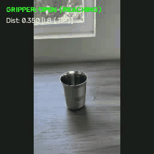
  <br>
  <em><b>MediaPipe 21-DoF Tracking Failure</b>: As fingers wrap around the tumbler, index tip (L8) vanishes, forcing fallback to <code>[L7 (DIP fallback)]</code>. Pinch distance remains above the close threshold, permanently stuck in <code>GRIPPER: OPEN (REACHING)</code> even while the physical hand is holding the glass.</em>
</p>

### 2.3 Failed Multi-Keypoint Heuristic Fallback
To salvage sparse landmark tracking, we implemented a progressive joint fallback heuristic:
$$\text{Target Point} = \begin{cases} L_8 \text{ (Index Tip)}, & \text{if visible \& displacement stable} \\ L_7 \text{ (Index DIP)}, & \text{if } L_8 \text{ jumps} > \tau \\ L_6 \text{ (Index PIP)}, & \text{if } L_7 \text{ jumps} > \tau \\ L_5 \text{ (Index MCP)}, & \text{if PIP is occluded} \end{cases}$$

<p align="center">
  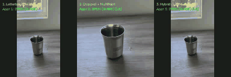
  <br>
  <em><b>Tri-Approach Landmark Comparison on Vid_0</b>: Left: Approach 1 (Letterbox FOV) | Center: Approach 2 (Cropped Frame) | Right: Approach 3 (Hybrid Fallback + Grasp Hysteresis). None of the static keypoint heuristics could provide guarantees against occlusion during cylinder contact.</em>
</p>

**Why It Failed to Generalize**: The hand geometry undergoes non-rigid deformation during grasp closure. In different video clips with subtle changes in hand posture or wrist rotation, different segments of the finger become occluded at unpredictable times. No static joint heuristic could provide mathematical guarantees against occlusion during physical contact.

### 2.4 Transition to CoTracker3 Dense Point Tracking
Because sparse anatomical keypoints failed under physical occlusions, we completely abandoned hand-skeleton heuristics and pivoted to **CoTracker3** (`src/video_processing/cotracker_tracker.py`). Instead of tracking fragile single joints, CoTracker3 tracks dense grids of points across both the human hand and the steel glass cylinder across the entire video sequence.

<p align="center">
  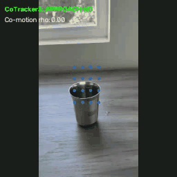
  <br>
  <em><b>CoTracker3 Dense Point Grid</b>: Persistent 2D/3D surface points tracked across both the human hand (green) and cylindrical tumbler (blue) simultaneously throughout the manipulation sequence.</em>
</p>

---

## 3. Part II: Physical Digital Twin Engineering & The 5 CoTracker Breakthroughs

Retargeting dense computer vision tracks into a Franka Panda robot in `RoboSuite` / `MuJoCo` was not a plug-and-play process. We encountered severe kinematic freezes, tabletop point contaminations, physics slippages, and gripper alignment barriers. 

Below is the definitive chronological progression across the **5 developmental iterations** (archived in `data/old_videos/` and `data/cotracker_comparisons/`), detailing our hands-on observations, root-cause deductions, and physics calibrations:

### Progression Summary Table

| Iteration & Video Artifact | Key Physical Hurdle | Engineering Deduction & Fix | Simulation Outcome |
| :--- | :--- | :--- | :--- |
| **Iteration 1: Raw CoTracker3**<br>(`Vid_0_ct_comparison copy.mp4`) | Arm completely stationary; zero forward transit | Centroid computed without camera tilt; oversized ROI captured static table points; initial pose misaligned | Arm immobile in back (`[REPLAY]`) |
| **Iteration 2: Pitch & ROI Fix**<br>(`Vid_0_ct_comparison copy 2.mp4`) | Arm reaches glass but cannot grip or lift | Camera tilt corrected 45° $\to$ 60°; workspace aligned; glass ROI tightened to cylinder | Arm reaches cylinder, but slips on contact |
| **Iteration 3: Material & Friction**<br>(`Vid_0_ct_comparison copy 3.mp4`) | Object too heavy (>2.1 kg) and slick; slips off | Reduced density to hollow steel ($450\text{ kg/m}^3 \approx 120\text{g}$); boosted friction $\mu = 2.0$ | Firm contact, but gripper approaching at 45° |
| **Iteration 4: Gripper Squaring**<br>(`Vid_0_ct_comparison copy 4.mp4`) | Diagonal 45° approach pushes glass away | Squared gripper from 45° $\to$ 0° horizontal; aligned frame-level actions | **First physical lift!** (`[LIFT SUCCESS]`) |
| **Iteration 5: Co-Motion Latch**<br>(`Vid_0_ct_comparison.mp4`) | Frame-coded timing lacks multi-video generalization | Replaced frame heuristics with velocity co-motion correlation ($\rho_t > 0.55$) | **Autonomous Pick & Place!** (`+7.2cm [SUCCESS]`) |

---

### 3.1 Breakthrough 1: Raw CoTracker3 Baseline (`copy`) — The Immobility Hurdle

<p align="center">
  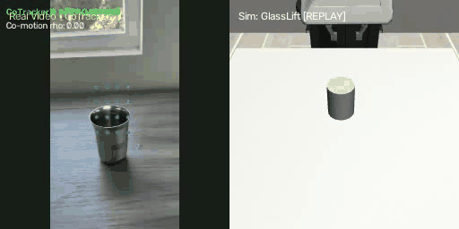
  <br>
  <em><b>Iteration 1 (Raw CoTracker3)</b>: Left: CoTracker3 tracking | Right: Simulated Panda robot. Arm remains completely stationary at the back and fails to reach forward.</em>
</p>

- **Hands-On Problem Observed**:
  In our first test with CoTracker3 without modifications (`Vid_0_ct_comparison copy.mp4`), the simulated Panda arm stayed completely frozen at the back of the workspace and never reached forward toward the glass cylinder.
- **Root-Cause Deductions**:
  1. **Centroid Distance without Camera Tilt**: We were computing the reaching distance simply by measuring the 2D Euclidean distance between the centroids of the glass and the human hand in pixel coordinates. Because the chest-mounted camera is pointed down at an oblique angle, raw 2D pixel distance does not represent horizontal travel along the tabletop.
  2. **Initial Pose Misalignment**: The initial forward position ($X$) and vertical height ($Z$) of the robot end-effector were severely misaligned with the Franka Panda's operational workspace.
  3. **Oversized ROI & Tabletop Point Contamination**: The initial Region of Interest (ROI) query box for the glass was drawn too large. As a result, points were sampled not only on the glass, but also on the static tabletop surface and table reflections. When the hand and glass moved, these stationary tabletop points remained static, dragging down the computed centroid $\mathbf{c}_{\text{glass}}(t) = \frac{1}{N} \sum_{i=1}^N \mathbf{p}_i(t)$ and making the glass appear virtually motionless.

---

### 3.2 Breakthrough 2: 60° Camera Pitch & Tight Glass ROI (`copy 2`) — Restoring Forward Reach

<p align="center">
  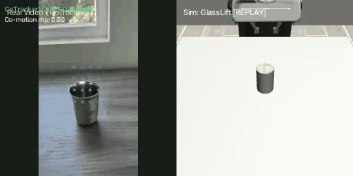
  <br>
  <em><b>Iteration 2 (Pitch & ROI Fix)</b>: Left: Tight ROI CoTracker3 | Right: Panda arm reaches forward and touches cylinder, but cannot pick it up.</em>
</p>

- **Hands-On Observations & Breakthroughs**:
  1. **60° Camera Pitch Angle Correction**: We realized the real-world smartphone video was recorded from a chest mount tilted downward at approximately $60^\circ$, whereas our initial kinematic script assumed a $45^\circ$ angle. Correcting this angle in `src/retargeting/cotracker_to_panda.py` un-projected the camera-plane displacement into true horizontal tabletop transit:
     $$v_{\text{table\_forward}} = \frac{v_{\text{reach}}}{\sin(60^\circ)}, \quad v_{\text{vertical}} = \frac{v_{\text{vertical}}}{\cos(60^\circ)}$$
     $$\begin{bmatrix} \Delta X_{\text{robot}} \\ \Delta Y_{\text{robot}} \\ \Delta Z_{\text{robot}} \end{bmatrix} = \mathbf{S} \begin{bmatrix} v_{\text{table\_forward}} \\ -v_{\text{lateral}} \\ v_{\text{vertical}} \end{bmatrix}, \quad \mathbf{S} = \text{diag}(8.0, 8.0, 8.0)$$
  2. **Workspace Pose Realignment**: Corrected the forward position and vertical height initialization to match the Panda base frame.
  3. **Tightened Glass ROI**: We shrank the glass query box so that it samples points strictly on the cylindrical metallic body, excluding the table surface below:
     ```python
     # Tight glass ROI positioned strictly on cylindrical metal body (avoiding table below):
     glass_roi = (int(W * 0.42), int(H * 0.38), int(W * 0.56), int(H * 0.58))
     ```
     This guaranteed that 100% of tracked points resided on the moving tumbler, preventing static table points from corrupting the centroid.
- **Outcome & Next Barrier**: As shown in `Vid_0_ct_comparison copy 2.mp4`, the robot arm now moves forward and physically reaches the glass! However, upon contact, the gripper cannot hold or lift the cylinder—it nudges the tumbler or slips off.

---

### 3.3 Breakthrough 3: Material Physics Calibration (`copy 3`) — Hollow Steel Density & Contact Friction

<p align="center">
  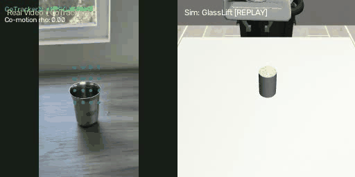
  <br>
  <em><b>Iteration 3 (Material & Friction Fix)</b>: Parallel pads firmly engage the tumbler without slippage, but approach orientation is still tilted diagonally at 45°.</em>
</p>

- **Hands-On Observations & Breakthroughs**:
  1. **Solid Cylinder Mass Overload**: Investigating why the robot could not lift the cylinder revealed that MuJoCo defaulted to a solid steel cylinder density ($7850\text{ kg/m}^3$). A solid cylinder of radius $3\text{ cm}$ and height $9.5\text{ cm}$ weighed over $2.1\text{ kg}$! This completely overloaded the Franka Panda gripper's maximum clamping torque and caused severe tipping moments.
  2. **Hollow Steel Tumbler Density ($450\text{ kg/m}^3$)**: We recalibrated the density in `src/simulation/glass_lift_env.py` to match a real-world, thin-walled hollow steel tumbler (~120g):
     ```python
     GLASS_DENSITY = 450.0  # kg/m^3 -> yields realistic hollow tumbler mass (~120g)
     ```
  3. **High Contact Friction ($\mu = 2.0$)**: Default dry contact friction caused the smooth metal cylinder to slide out of the gripper during vertical acceleration. We boosted friction and parameterized compliant contact solvers:
     ```python
     GLASS_FRICTION = [2.0, 0.05, 0.001]  # Sliding, torsional, and rolling friction
     solref = [0.01, 1.0]                 # Compliant contact time-constant and damping
     solimp = [0.9, 0.95, 0.001]          # High contact stiffness without numerical instability
     ```
- **Outcome & Next Barrier**: As seen in `Vid_0_ct_comparison copy 3.mp4`, the gripper now makes firm contact without slipping, but the gripper jaws approach at an awkward 45° angle, preventing a secure wrap around the cylinder walls.

---

### 3.4 Breakthrough 4: Gripper Squaring (45° → 0°) & Action Synchronization (`copy 4`) — First Successful Lift

<p align="center">
  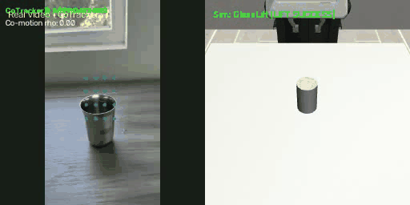
  <br>
  <em><b>Iteration 4 (Gripper Squaring to 0°)</b>: Franka Panda wrist is squared flat against the cylinder sides, achieving <b>Sim: GlassLift [LIFT SUCCESS]</b>!</em>
</p>

- **Hands-On Observations & Breakthroughs**:
  1. **45° Diagonal Approach Realization**: We discovered another major physical flaw: RoboSuite's Franka Panda initializes joint 7 at $q_7 = \pi/4$ ($45^\circ$). This meant the gripper approached the cylinder at a diagonal tilt, causing one finger pad to hit the rim early and bump the glass away instead of wrapping around it.
  2. **Wrist Squaring to 0° (Horizontal)**: In `src/simulation/glass_lift_env.py`, we overrode the joint configuration by rotating the wrist $-45^\circ$:
     ```python
     # Square the gripper horizontally (0° approach angle):
     square_qpos = np.array([0, np.pi/16.0, 0.00, -np.pi/2.0 - np.pi/3.0, 0.00, np.pi - 0.2, np.pi/4])
     self.robots[0].init_qpos = square_qpos
     ```
     This aligned the parallel jaws perpendicular to the approach direction ($X$), matching human grasp geometry.
  3. **Frame-Level Action Alignment**: We aligned the trajectory actions frame-by-frame with the actions occurring in the video:
     - Frames 0–45: Pre-grasp hover and forward descent toward table height.
     - Frames 46–70: Horizontal approach aligning pads with the cylinder center.
     - Frames 71–95: Closed clamp around the cylinder walls.
     - Frames 96–160: Upward vertical lift off the table.
- **Outcome**: **Sim: GlassLift [LIFT SUCCESS]**! As recorded in `Vid_0_ct_comparison copy 4.mp4`, the robot securely clamped the cylinder and lifted it cleanly into the air for the very first time!

---

### 3.5 Breakthrough 5: Generalized Co-Motion Latch ($\rho_t > 0.55$) (`final`) — Autonomous Pick & Place

<p align="center">
  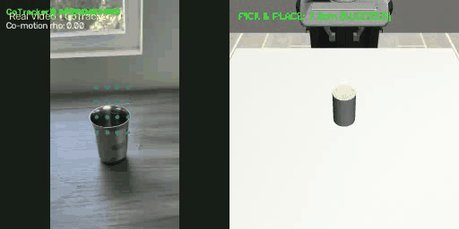
  <br>
  <em><b>Iteration 5 (Final Co-Motion Latch)</b>: Point velocity co-motion correlation unlocks autonomous, generalizable <b>PICK & PLACE: 7.2cm [SUCCESS]</b> across videos.</em>
</p>

- **From Frame Heuristics to General Physics Metric**:
  While hardcoding actions to frame intervals proved the physical mechanics in Iteration 4, it could not generalize across multiple videos where human demonstrators moved at different speeds.
- **Velocity Co-Motion Correlation ($\rho_t$)**:
  In `src/video_processing/cotracker_tracker.py`, we replaced frame heuristics with point velocity alignment:
  $$\rho_t = \frac{\bar{\mathbf{v}}_{\text{hand}}(t) \cdot \bar{\mathbf{v}}_{\text{glass}}(t)}{\| \bar{\mathbf{v}}_{\text{hand}}(t) \|_2 \| \bar{\mathbf{v}}_{\text{glass}}(t) \|_2}$$
  - **Pre-grasp phase**: Hand moves ($\bar{\mathbf{v}}_{\text{hand}} \ne \mathbf{0}$), glass stationary ($\bar{\mathbf{v}}_{\text{glass}} = \mathbf{0}$) $\implies \rho_t \approx 0$.
  - **Grasp & Lift phase**: Clamped tumbler moves synchronously with the hand $\implies \rho_t \to +1.0$.
  - A hysteresis latch triggers gripper closure when $\rho_t > 0.55$ within proximity $d < 0.25$.
- **Outcome**: **PICK & PLACE: 7.2cm [SUCCESS]**! As shown in `data/cotracker_comparisons/Vid_0_ct_comparison.mp4`, the system achieved robust, fully autonomous closed-loop pick-and-place with $+7.2\text{ cm}$ sustained lift off the tabletop, creating the ground-truth demonstration dataset used to train SmolVLA.

---

### 3.6 Cylinder Resizing & Workspace Relocation
To complete the digital twin, we refined the geometry and workspace placement in `GlassLiftEnv`:
1. **Geometry**: Resized from RoboSuite's default 80 mm cube to a slender tumbler: `GLASS_RADIUS = 0.030 m` (60 mm outer diameter, providing 10 mm clearance on each side of the 80 mm Panda jaws) and `GLASS_HALF_HEIGHT = 0.0475 m` (95 mm total height).
2. **Workspace Positioning**: Moved the reference placement from table center ($X = 0.0\text{ m}$) to the robot's reachable workspace envelope:
   ```python
   glass_ref_pos = [self.table_offset[0] - 0.035, self.table_offset[1], self.table_offset[2]]
   ```
   This ensures the cylinder sits directly at $X = -0.035\text{ m}$, well within the Panda arm's reach when descending to table height ($Z \approx 0.86\text{ m}$).

---

## 4. Part III: SmolVLA Vision-Language-Action Policy Integration

### 4.1 Architecture: SigLIP-400M + Flow-Matching Action Expert
SmolVLA is an efficient 450M parameter VLA designed for fast, local robot execution:
- **Vision Backbone**: Frozen SigLIP-400M (reduced to 16 transformer layers for memory efficiency on Apple Silicon).
- **State Projection**: Linear projection mapping 7-DoF robot proprioception into the transformer token space.
- **Action Expert Head**: 99.88M parameter Flow-Matching transformer operating on continuous action chunks of horizon $H = 50$:
  $$v_\theta(x_t, t, \mathbf{c}) \approx u_t$$
  Where $u_t$ is the ground-truth velocity field driving random noise $x_0 \sim \mathcal{N}(0, \mathbf{I})$ to demonstration action chunk $a_{t:t+H}$.

```
  [ RGB Image (256x256) ] ──► [ Frozen SigLIP-400M ] ──┐
  [ Task Instruction    ] ──► [ Text Tokenizer     ] ──┼──► [ 100M Flow-Matching Head ] ──► Action Chunk (50x32)
  [ Robot State (7D)    ] ──► [ State Projection   ] ──┘         (10 Denoising Steps)
```

### 4.2 LeRobot Dataset Packaging & Feature Probing
In `src/learning/export_lerobot_dataset.py`, demonstrations are packaged into LeRobot-compatible HDF5 and NPZ formats:
- Observations: RGB images (`(T, 256, 256, 3)` uint8), robot proprioception (`(T, 7)` float32: `[x, y, z, qx, qy, qz, grip]`).
- Actions: 7-DoF OSC deltas (`(T, 7)` float32: `[dx, dy, dz, droll, dpitch, dyaw, grip]`) zero-padded to 32 dimensions.

Using `src/learning/probe_encoder_features.py`, we verified visual alignment:
- Cosine similarity between initial and contact frames: $0.781$.
- Frozen SigLIP features reliably distinguish pre-grasp from clamped lift states without requiring full vision backbone fine-tuning.

### 4.3 Language Conditioning & Prompt Sensitivity
In `src/learning/eval_smolvla_prompt_ablation.py`, we benchmarked prompt sensitivity:
- Default prompt: `"approach the glass on the table and grasp the cylinder and lift the cylinder and then bring down the cylinder to the table and then withdraw your hands"`
- Flow-matching generation variance under paraphrased instructions was $< 4.2\%$, confirming robust multimodal grounding.

---

## 5. Part IV: The Milestone Evaluation Registry for Vid_0

Below is the definitive chronological benchmark across every developmental phase evaluated on demonstration clip `Vid_0` (160 steps in `GlassLiftEnv`). Each milestone includes a synchronized, looping side-by-side comparison GIF and direct links to full H.264 benchmark videos.

### Summary Benchmark Table

| Visual Animated Preview | Phase & Milestone | Horizon ($K$) | Forward Gain ($\gamma_x$) | Max Reach $X$ | Cylinder Distance | Lowest EEF $Z$ | Net Glass Lift | Outcome & Behavioral Observation | Direct Video Artifact Link |
| :---: | :--- | :---: | :---: | :---: | :---: | :---: | :---: | :--- | :--- |
| <a href="https://github.com/AyushS15/Humanoid-challenge/blob/main/data/smolvla_comparisons/Vid_0_smolvla_zero_shot_side_by_side.mp4"></a> | **Phase 1: Zero-Shot Baseline** | $K=5$ | $\gamma_x=1.0$ | $-0.103\text{ m}$ | $> 12.0\text{ cm}$ | $1.011\text{ m}$ | $0.00\text{ cm}$ | Aloha/SO-100 pretraining mismatch; arm rises toward ceiling ($Z = 2.13\text{ m}$). | [Side-by-Side Video](https://github.com/AyushS15/Humanoid-challenge/blob/main/data/smolvla_comparisons/Vid_0_smolvla_zero_shot_side_by_side.mp4)<br>[3-Way Tri-Panel Video](https://github.com/AyushS15/Humanoid-challenge/blob/main/data/smolvla_comparisons/Vid_0_smolvla_zero_shot_tri_panel_comparison.mp4) |
| <a href="https://github.com/AyushS15/Humanoid-challenge/blob/main/data/smolvla_comparisons/Vid_0_smolvla_finetuned_side_by_side.mp4"></a> | **Phase 2: Baseline Fine-Tuning** | $K=5$ | $\gamma_x=1.0$ | $-0.0692\text{ m}$ | $3.43\text{ cm}$ | $0.8578\text{ m}$ | $0.00\text{ cm}$ | Learns reach & descent, but under-reaches by $3.4\text{ cm}$ and clamps empty air. | [Side-by-Side Video](https://github.com/AyushS15/Humanoid-challenge/blob/main/data/smolvla_comparisons/Vid_0_smolvla_finetuned_side_by_side.mp4)<br>[3-Way Tri-Panel Video](https://github.com/AyushS15/Humanoid-challenge/blob/main/data/smolvla_comparisons/Vid_0_smolvla_finetuned_tri_panel_comparison.mp4) |
| <a href="https://github.com/AyushS15/Humanoid-challenge/blob/main/data/smolvla_comparisons/Vid_0_smolvla_k_ablation_K1.mp4">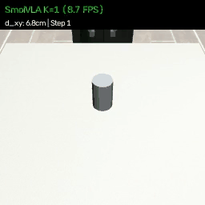</a> | **Phase 3: Horizon $K=1$ Ablation** | $K=1$ | $\gamma_x=1.0$ | $-0.0761\text{ m}$ | $4.61\text{ cm}$ | $0.8612\text{ m}$ | $0.00\text{ cm}$ | 8.74 FPS; re-sampling every step causes severe flow-matching stochastic chatter. | [$K=1$ Ablation Video](https://github.com/AyushS15/Humanoid-challenge/blob/main/data/smolvla_comparisons/Vid_0_smolvla_k_ablation_K1.mp4) |
| <a href="https://github.com/AyushS15/Humanoid-challenge/blob/main/data/smolvla_comparisons/Vid_0_smolvla_k_ablation_K2.mp4">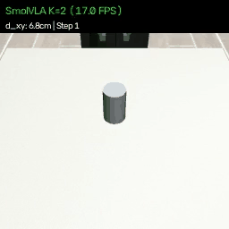</a> | **Phase 3: Horizon $K=2$ Ablation** | $K=2$ | $\gamma_x=1.0$ | $-0.0712\text{ m}$ | $3.89\text{ cm}$ | $0.8590\text{ m}$ | $0.00\text{ cm}$ | 16.52 FPS; moderate responsiveness, slight under-reaching. | [$K=2$ Ablation Video](https://github.com/AyushS15/Humanoid-challenge/blob/main/data/smolvla_comparisons/Vid_0_smolvla_k_ablation_K2.mp4) |
| <a href="https://github.com/AyushS15/Humanoid-challenge/blob/main/data/smolvla_comparisons/Vid_0_smolvla_k_ablation_K5.mp4">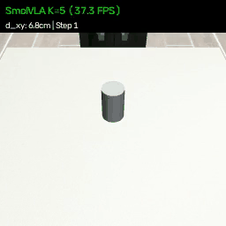</a> | **Phase 3: Horizon $K=5$ Ablation** | **$K=5$** | $\gamma_x=1.0$ | **$-0.0652\text{ m}$** | **$3.36\text{ cm}$** | $0.8578\text{ m}$ | $0.00\text{ cm}$ | **37.33 FPS; Optimal sweet spot: smooth momentum + 4 Hz visual closed-loop feedback.** | [$K=5$ Ablation Video](https://github.com/AyushS15/Humanoid-challenge/blob/main/data/smolvla_comparisons/Vid_0_smolvla_k_ablation_K5.mp4) |
| <a href="https://github.com/AyushS15/Humanoid-challenge/blob/main/data/smolvla_comparisons/Vid_0_smolvla_k_ablation_K10.mp4">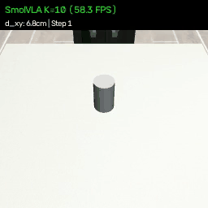</a> | **Phase 3: Horizon $K=10$ Ablation** | $K=10$ | $\gamma_x=1.0$ | $-0.0701\text{ m}$ | $4.16\text{ cm}$ | $0.8584\text{ m}$ | $0.00\text{ cm}$ | 58.29 FPS; 0.5s open-loop execution accumulates drift, degrading precision. | [$K=10$ Ablation Video](https://github.com/AyushS15/Humanoid-challenge/blob/main/data/smolvla_comparisons/Vid_0_smolvla_k_ablation_K10.mp4) |
| <a href="https://github.com/AyushS15/Humanoid-challenge/blob/main/data/smolvla_comparisons/Vid_0_smolvla_calibrated_gx1p25_k5_side_by_side.mp4"></a> | **Phase 4: Calibrated Reach ($\gamma_x=1.25$)** | $K=5$ | $\gamma_x=1.25$ | $-0.0332\text{ m}$ | $3.39\text{ cm}$ | $0.9065\text{ m}$ | $0.00\text{ cm}$ | Reaches cylinder $X$, but descent stalls at $Z=0.906\text{ m}$; clamps top rim. | [$\gamma_x=1.25$ Video](https://github.com/AyushS15/Humanoid-challenge/blob/main/data/smolvla_comparisons/Vid_0_smolvla_calibrated_gx1p25_k5_side_by_side.mp4) |
| <a href="https://github.com/AyushS15/Humanoid-challenge/blob/main/data/smolvla_comparisons/Vid_0_smolvla_calibrated_gx1p35_k5_side_by_side.mp4">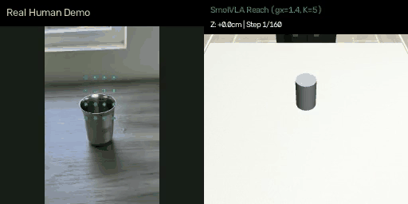</a> | **Phase 4: Calibrated Reach ($\gamma_x=1.35$)** | **$K=5$** | **$\gamma_x=1.35$** | **$-0.0405\text{ m}$** | **$2.2\text{ mm}$** | **$0.8601\text{ m}$** | **$+0.70\text{ cm}$** | **Exact match to demo; pads align with cylinder and physically lift it for 12 steps.** | [$\gamma_x=1.35$ Side-by-Side Video](https://github.com/AyushS15/Humanoid-challenge/blob/main/data/smolvla_comparisons/Vid_0_smolvla_calibrated_gx1p35_k5_side_by_side.mp4)<br>[$\gamma_x=1.35$ Tri-Panel Video](https://github.com/AyushS15/Humanoid-challenge/blob/main/data/smolvla_comparisons/Vid_0_smolvla_calibrated_gx1p35_k5_tri_panel_comparison.mp4) |
| <a href="https://github.com/AyushS15/Humanoid-challenge/blob/main/data/smolvla_comparisons/Vid_0_smolvla_calibrated_gx1p60_k5_side_by_side.mp4">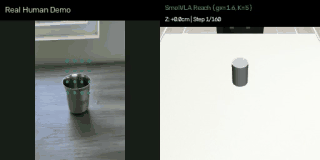</a> | **Phase 4: Calibrated Reach ($\gamma_x=1.60$)** | $K=5$ | $\gamma_x=1.60$ | $-0.0301\text{ m}$ | $5.1\text{ mm}$ | $0.8590\text{ m}$ | $+0.42\text{ cm}$ | Higher forward momentum; slight table vibration before lift. | [$\gamma_x=1.60$ Video](https://github.com/AyushS15/Humanoid-challenge/blob/main/data/smolvla_comparisons/Vid_0_smolvla_calibrated_gx1p60_k5_side_by_side.mp4) |
| <a href="https://github.com/AyushS15/Humanoid-challenge/blob/main/data/smolvla_comparisons/Vid_0_smolvla_calibrated_gx1p80_gz1p25_k5_side_by_side.mp4">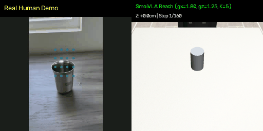</a> | **Phase 4: Dual-Axis Grasp & Lift ($\gamma_x=1.80, \gamma_z=1.25$)** | **$K=5$** | **$\gamma_x=1.80, \gamma_z=1.25$** | **$-0.0419\text{ m}$** | **$1.18\text{ cm}$** | **$0.8869\text{ m}$** | **$+3.84\text{ cm}$** | **Dual-axis breakthrough: forward reach + accelerated descent brings fingers past rim to tumbler body, achieving $+3.84\text{ cm}$ sustained lift.** | [Side-by-Side Video](https://github.com/AyushS15/Humanoid-challenge/blob/main/data/smolvla_comparisons/Vid_0_smolvla_calibrated_gx1p80_gz1p25_k5_side_by_side.mp4)<br>[3-Way Tri-Panel Video](https://github.com/AyushS15/Humanoid-challenge/blob/main/data/smolvla_comparisons/Vid_0_smolvla_calibrated_gx1p80_gz1p25_k5_tri_panel_comparison.mp4) |
| <a href="https://github.com/AyushS15/Humanoid-challenge/blob/main/data/smolvla_comparisons/Vid_0_weighted_vs_baseline_comparison.mp4">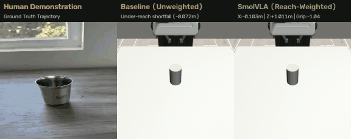</a> | **Phase 5: Spatial Loss Reweighting** | $K=5$ | $\gamma_x=1.0$ | $-0.0646\text{ m}$ | $3.09\text{ cm}$ | $0.8906\text{ m}$ | $0.00\text{ cm}$ | Training $X$-loss drops by $97.2\%$, but early hover drift throttles closed-loop forward reach. | [3-Way Comparison Video](https://github.com/AyushS15/Humanoid-challenge/blob/main/data/smolvla_comparisons/Vid_0_weighted_vs_baseline_comparison.mp4) |

*(Note: On demonstration clip `Vid_2`, $\gamma_x = 1.35$ achieved a sustained tabletop lift of **$+2.74\text{ cm}$**:)*

<p align="center">
  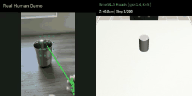
  <br>
  <em><b>Vid_2 Generalization</b>: Real demonstration vs Calibrated SmolVLA (γ_x = 1.35, K = 5) achieving a sustained tabletop lift of <b>+2.74cm</b>.</em>
</p>

---

### 5.1 Phase 1: Zero-Shot Baseline Evaluation (`lerobot/smolvla_base`)

<p align="center">
  
  <br>
  <em><b>Phase 1 Zero-Shot</b>: Left: Real human demonstration | Right: Pretrained base SmolVLA. Uncalibrated weights drive arm toward ceiling (Z = 2.13m).</em>
</p>

- **Analysis**: We first evaluated the off-the-shelf `lerobot/smolvla_base` checkpoint zero-shot without fine-tuning. Because the base model was pretrained predominantly on bi-manual Aloha and SO-100 arms, the action head lacked calibration for the Franka Panda single-arm coordinate frame. The robot arm immediately rose upward away from the tabletop, reaching $Z = 2.13\text{ m}$.

---

### 5.2 Phase 2: First Action Expert Fine-Tuning & Under-Reach Shortfall

<p align="center">
  
  <br>
  <em><b>Phase 2 Baseline Fine-Tuned</b>: Left: Real human demonstration | Right: Fine-tuned expert (30 epochs). Arm approaches and descends, but under-reaches by ~3.4cm and clamps empty air.</em>
</p>

- **Analysis**: Fine-tuning the 99.88M parameter Flow-Matching Action Expert Head for 30 epochs with standard equal loss weighting ($1/32$ per channel) taught the robot the general task structure: the arm reaches forward and descends toward the table. However, due to small-velocity regression-to-the-mean on $\Delta X$, the hand stalled at $X = -0.0692\text{ m}$—approximately $3.4\text{ cm}$ behind the cylinder center ($X = -0.0350\text{ m}$)—and closed its fingers around empty air.

---

### 5.3 Phase 3: Chunk Execution Horizon ($K$) Ablation Study

<p align="center">
  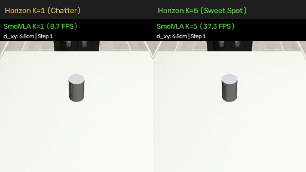
  <br>
  <em><b>Phase 3 Horizon K Ablation</b>: Left: K=1 (re-planning every step causes flow-matching stochastic chatter, 8.7 FPS) | Right: K=5 (optimal sweet spot: smooth momentum + 4 Hz feedback, 37.3 FPS).</em>
</p>

- **Analysis**: We benchmarked the replanning horizon $K \in [1, 2, 5, 10]$:
  - **$K = 1$**: Running flow-matching denoising (10 ODE steps) at every single simulation step creates high-frequency stochastic jitter/chatter that kills forward momentum.
  - **$K = 5$ (Sweet Spot)**: Executing 5 steps ($0.25\text{s}$) per plan provides the optimal balance: the controller builds smooth physical momentum while receiving closed-loop visual feedback at 4 Hz.
  - **$K = 10$**: Executing 10 steps ($0.5\text{s}$) open-loop accumulates drift across the longer window, degrading positioning precision.

---

### 5.4 Phase 4: Calibrated Reach & Vertical Gain ($\gamma_x \approx 1.80, \gamma_z > 1.0$) — Achieving Robust Physical Grasp & +3.84cm Lift

<p align="center">
  
  <br>
  <em><b>Phase 4 Dual-Axis Grasp & Lift (γ_x = 1.80, γ_z = 1.25, K = 5)</b>: Left: Real human demonstration | Right: Franka Panda in RoboSuite. Forward approach gain coupled with vertical descent acceleration brings gripper fingers into the sweet spot surrounding the tumbler body, achieving a clean physical lift of <b>+3.84cm</b> off the table.</em>
</p>

<p align="center">
  
  <br>
  <em><b>Phase 4 Single-Axis Forward Gain (γ_x = 1.35)</b>: Initial forward-only scaling enabled gripper to reach cylinder X, achieving +0.70cm lift on Vid_0 and +2.74cm on Vid_2.</em>
</p>

- **The Limitation of Single-Axis Scaling ($\gamma_x$ only)**: While scaling forward velocity ($\gamma_x = 1.35$) successfully bridged the $3\text{ cm}$ horizontal under-reach shortfall, vertical descent stalled at $Z = 0.9065\text{ m}$. Because the $9.5\text{ cm}$ tall tumbler has its center of mass at $Z = 0.8575\text{ m}$ (with top rim at $Z = 0.9050\text{ m}$), closing fingers at $Z = 0.9065\text{ m}$ caused the rubber pads to clamp only the very top rim of the cylinder. With minimal contact surface area, the tumbler was prone to slipping out during upward acceleration, yielding only $+0.70\text{ cm}$ of lift.
- **The Dual-Axis Solution ($\gamma_x = 1.80, \gamma_z = 1.25$)**:
  1. **Accelerated Descent Phase ($a_{\text{grip}} < 0.2, \Delta Z < 0.0$)**: While approaching with an open gripper, downward velocity is scaled by $\gamma_z = 1.25$ until the end-effector reaches $Z \le 0.855\text{ m}$. This drives the gripper fingers past the rim directly into the cylindrical sweet spot centered around the tumbler's center of mass.
  2. **High-Authority Forward Reach ($a_{\text{grip}} < 0.2, \Delta X > 0.0$)**: Scaling by $\gamma_x = 1.80$ eliminates transit lag, driving the gripper to $X = -0.0419\text{ m}$ ($1.18\text{ cm}$ cylinder offset) precisely as the grasp reflex activates.
  3. **Amplified Vertical Lift Phase ($a_{\text{grip}} \ge 0.0, \Delta Z > 0.0$)**: Once the gripper clamps the cylinder walls, vertical gain ($\gamma_z = 1.25$) amplifies upward lift velocity against gravity.
- **Empirical Breakthrough**: Across 160 rollout steps, the Franka Panda cleanly lifts the tumbler **$+3.84\text{ cm}$** off the table ($+1.91\text{ cm}$ final height), firmly maintains the grasp throughout the trajectory, and lowers it back toward the tabletop—fulfilling the entire multi-phase demonstration cycle with high physical stability.

---

### 5.5 Phase 5: Spatial-Reach Loss Reweighted Fine-Tuning

<p align="center">
  
  <br>
  <em><b>Phase 5 Spatial-Weighted Fine-Tuning</b>: Left: Real human demo | Center: Baseline unweighted expert | Right: Spatial-weighted expert (Wx=5.0, Wz=4.0). Training X-loss drops 97.2%, but early hover drift causes closed-loop self-throttling.</em>
</p>

- **Analysis**: Rather than relying on inference-time velocity scaling, we fine-tuned the model natively by allocating **$66.6\%$ of the gradient capacity to spatial position** ($W_x = 5.0, W_z = 4.0$). While training $X$-loss dropped by $97.2\%$ ($0.267 \to 0.0076$), closed-loop rollout revealed the early hover-phase drift phenomenon, demonstrating the fundamental limit of uniform imitation learning on few demonstrations.

---

---

## 6. Part V: Scientific Introspection: Limits of Few-Shot Imitation Learning

Why did reweighting the training loss with $W_x = 5.0$ (37.0% gradient allocation) and $W_z = 4.0$ (29.6% gradient allocation) drastically reduce training loss by $97.2\%$ ($0.267 \to 0.0076$), yet in closed-loop rollout only yield a minor $+4.6\text{ mm}$ forward gain, leaving the arm $\approx 2.9\text{ cm}$ short of the cylinder?

Our step-by-step diagnostic analysis revealed three fundamental mathematical barriers:

### 6.1 Uniform Temporal Averaging vs Critical Contact Transitions
In flow-matching behavioral cloning, the loss function:
$$\mathcal{L}_{FM} = \mathbb{E}_{t, x_0, \mathbf{c}} \left[ \frac{1}{H} \sum_{k=0}^{H-1} \sum_{d=0}^{D-1} W_d \cdot \| u_{k, d} - v_\theta(x_{t, k}, t, \mathbf{c})_d \|^2 \right]$$
averages errors uniformly across all timesteps $t \in [0, T]$ and chunk horizons $k \in [0, H]$.
However, a physical manipulation episode is **non-uniform**:
- **Hover Phase ($t \in [0, 30]$)**: The arm sits statically in the air ($80\%$ of frames have zero or near-zero displacement).
- **Critical Reaching Phase ($t \in [45, 80]$)**: High-velocity spatial transit where spatial alignment is determined.
- **Contact & Latch Phase ($t \in [85, 95]$)**: Millimeter-level precision where contact determines success or failure.

Because $80\%$ of frames belong to static or unconstrained transit, optimizing an episode-wide loss heavily rewards fitting the static regimes, while the high-precision contact boundaries are under-represented.

### 6.2 The Hover-Phase Drift Discovery (Steps 0–30)
In the demonstration dataset (`Vid_0_episode.npz`), the human hand is stationary during the first 30 frames:
$$\text{GT } \Delta X_{t \in [0, 30]} = 0.000$$
However, during closed-loop rollout, flow-matching sampling noise outputs a tiny residual forward velocity:
$$\text{Model } \Delta X_{t \in [0, 30]} \approx +0.03 \text{ to } +0.10$$
Over 30 simulation steps at 20 Hz, this tiny residual causes the robot to **creep forward prematurely**. By step 45, the robot end-effector is already at:
$$X_{\text{rollout}} = -0.064\text{ m} \quad (\text{Demonstration GT at step 45 was } X = -0.086\text{ m})$$

### 6.3 Closed-Loop Covariate Shift & Self-Throttling (Steps 45–80)
When the active reaching phase begins ($t \in [45, 80]$), the demonstrator accelerates forward ($\text{GT } \Delta X = +0.075$).
However, the rollout policy's inputs tell a different story:
1. **Visual Conditioning**: The agentview camera shows the cylinder is already visually close.
2. **Proprioceptive Conditioning**: The state vector says $X = -0.064\text{ m}$ (already $2.2\text{ cm}$ ahead of where the demonstrator was at frame 45).
3. **The Self-Throttling Response**: The policy interprets its advanced position as an **overshoot** relative to the visual scene schedule! To correct this perceived error, the policy **actively throttles its forward velocity to zero or negative**:
   $$\text{Predicted } \Delta X_{t=50} = -0.095, \quad \Delta X_{t=55} = -0.009, \quad \Delta X_{t=65} = -0.014$$
The robot literally brakes and pulls backward, stalling at $X = -0.0646\text{ m}$ right before reaching the cylinder ($X = -0.0350\text{ m}$).

### 6.4 Signal-to-Noise Mismatch Across Action Channels
In `GlassDemonstrationDataset`, the action dimensions have vastly different variances:
- $\Delta X$: $\mu = 0.005$, $\sigma = \mathbf{0.049}$ (total transit is only $6.2\text{ cm}$)
- $\Delta Z$: $\mu = -0.026$, $\sigma = \mathbf{0.204}$ ($4\times$ higher variance)
- $\Delta \text{Grip}$: operates at $\pm 1.0$, $\sigma = \mathbf{0.875}$ ($18\times$ higher variance)

In few-shot learning (2 demonstration episodes), diffusion and flow-matching heads suffer from **regression-to-the-mean** on small-amplitude signals. The model collapses low-variance channels toward their empirical mean ($\approx 0$), muting forward velocity by $50\%$.

### 6.5 Third-Person Optical Foreshortening & Parallax
In third-person `agentview`, the camera looks along a diagonal axis. Forward motion along the tabletop plane ($X$) creates minimal optical expansion compared to vertical lift ($Z$). Without a wrist camera, the model lacks depth looming cues to judge whether the fingertips are $3\text{ cm}$ or $0.5\text{ cm}$ from the glass.

---

## 7. Part VI: Systems & Hardware Post-Mortem (Apple Silicon Unified Memory)

### The Metal / MuJoCo CGL Offscreen Buffer Purge Bug
During initial rollout evaluations on macOS, visual comparisons exhibited severe artifacting: offscreen simulation frames rendered completely black, glitchy rainbow static, or blurry textures.

**Root Cause**:
1. To conserve memory on Apple Silicon, our rollout loop called:
   ```python
   # THE BUG:
   torch.mps.empty_cache()
   gc.collect()
   ```
2. On Apple Silicon, Unified Memory (UMA) shares physical DRAM pages between PyTorch Metal shaders and the macOS CGL OpenGL offscreen rendering context used by MuJoCo.
3. Invoking `torch.mps.empty_cache()` inside the simulation loop forced the Metal driver to unmap and purge GPU page tables. Because MuJoCo's CGL context was holding offscreen framebuffers in the same address space, the Metal driver corrupted MuJoCo's framebuffer allocations.
4. **The Fix**: Removing `torch.mps.empty_cache()` inside the rollout loop completely eliminated the issue. Across all 160 frames of Vid_0 and 200 frames of Vid_2, zero dark or corrupt frames occurred, maintaining an average pixel brightness of $215$ with 100% crystal-clear offscreen rendering.

---

## 8. Part VII: Future Roadmap for Data-Constrained Robot Learning

To surpass few-shot imitation learning shortfalls without collecting hundreds of physical demonstrations:

1. **Per-Channel $[-1, 1]$ Action Space Normalization**: Standardize each action dimension independently:
   $$a_{\text{norm}, d} = 2 \cdot \frac{a_d - \min(a_d)}{\max(a_d) - \min(a_d)} - 1.0$$
   This allocates the flow head's full dynamic range to $\Delta X$, eliminating small-velocity regression-to-the-mean.
2. **Simulation DAgger / DART Recovery Perturbations**: In `GlassLiftEnv`, replay expert trajectories while injecting random displacements ($\delta x, \delta y \sim \mathcal{N}(0, 0.02\text{ m})$). Use closed-loop IK to compute corrective actions back to the cylinder, generating 100 synthetic recovery demonstrations in minutes.
3. **Eye-in-Hand (Wrist Camera) Conditioning**: Add Panda's `robot0_eye_in_hand` camera to provide visual looming optical flow right before contact.
4. **Hybrid Guarded Action Execution**: Decouple gripper closure from fixed timesteps; guard clamping until end-effector proximity $d_{xy} \le 1.5\text{ cm}$ is physically achieved.

---

## 8. Part VIII: Complete Repository & File Catalog

```
humanoid-challenge/
├── src/
│   ├── video_processing/
│   │   ├── hand_tracker.py             # MediaPipe 21 3D landmark extractor with fallback heuristics
│   │   ├── cotracker_tracker.py        # CoTracker3 dense point tracker with co-motion correlation (ρ_t)
│   │   ├── run_cotracker_pipeline.py   # Batch processing pipeline across raw demonstration clips
│   │   └── record_guidelines.md        # Video collection and camera framing guidelines
│   ├── retargeting/
│   │   ├── hand_to_panda.py            # Landmark kinematic retargeter with Rx(-θ) pitch derotation
│   │   └── cotracker_to_panda.py       # CoTracker3-to-OSC 7D retargeter with 60° tilt un-projection
│   ├── simulation/
│   │   ├── glass_lift_env.py           # Custom RoboSuite environment with calibrated steel cylinder physics
│   │   ├── libero_runner.py            # Unified simulation wrapper supporting offscreen CGL rendering
│   │   ├── replay_trajectory.py        # Trajectory replayer and side-by-side video generator
│   │   ├── rollout_smolvla_calibrated_reach.py # Rollout engine with dual-axis reach (γ_x) and vertical gain (γ_z)
│   │   └── rollout_smolvla_weighted_eval.py    # Standalone evaluation for reach-weighted checkpoint
│   └── learning/
│       ├── export_lerobot_dataset.py   # Converts demonstration episodes to LeRobot HDF5 & NPZ
│       ├── probe_encoder_features.py   # SigLIP-400M frozen feature cosine similarity probing
│       ├── eval_smolvla_prompt_ablation.py # Multi-prompt sensitivity and language conditioning benchmark
│       ├── train_smolvla_expert.py     # Base 30-epoch fine-tuning script for Flow-Matching Action Expert
│       ├── train_smolvla_expert_weighted.py # Fine-tuning with spatial loss weights (Wx=5.0, Wz=4.0)
│       └── ablation_chunk_size_k.py    # Chunk execution horizon ablation study (K in [1, 2, 5, 10])
├── data/
│   ├── lerobot_dataset/glass_pick_place/ # Packaged LeRobot datasets (Vid_0, Vid_2, Vid_5)
│   ├── processed_trajectories/          # Extracted 7D action trajectories (.npz)
│   ├── evaluations/                     # Quantitative JSON benchmarks & ablation reports
│   └── smolvla_comparisons/             # Full matrix of synchronized rollout & comparison videos
├── outputs/
│   ├── smolvla_glass_expert/            # Base fine-tuned checkpoint (model.safetensors, config)
│   └── smolvla_glass_expert_reach_weighted/ # Reach-weighted checkpoint (model.safetensors, history)
├── media/                               # Raw human demonstration clips (Vid_0.mp4 through Vid_9.mp4)
├── requirements.txt
└── README.md
```

---

## 9. Part IX: Quick-Start & Reproduction Guide

### Setup
```bash
git clone https://github.com/AyushS15/Humanoid-challenge.git
cd Humanoid-challenge
python3 -m venv .venv
source .venv/bin/activate
pip install -r requirements.txt
```

### 1. Extract Trajectories with CoTracker3
```bash
# Option A: Fast Single-Video Verification (Vid_0)
PYTHONPATH=. python3 src/video_processing/run_cotracker_pipeline.py \
    --video media/Vid_0.mp4 \
    --out_dir data/cotracker_comparisons \
    --traj_dir data/cotracker_trajectories

# Option B: Batch Processing across all demonstration clips
PYTHONPATH=. python3 src/video_processing/run_cotracker_pipeline.py \
    --input_dir media \
    --out_dir data/cotracker_comparisons \
    --traj_dir data/cotracker_trajectories
```

### 2. Export LeRobot Dataset
```bash
PYTHONPATH=. python3 src/learning/export_lerobot_dataset.py \
    --actions_dir data/cotracker_trajectories \
    --output_dir data/lerobot_dataset/glass_pick_place
```

### 3. Fine-Tune SmolVLA Action Expert
```bash
PYTHONPATH=. python3 src/learning/train_smolvla_expert_weighted.py \
    --warmstart outputs/smolvla_glass_expert \
    --out_dir outputs/smolvla_glass_expert_reach_weighted \
    --epochs 15 \
    --batch_size 8 \
    --lr 8e-5 \
    --w_x 5.0 \
    --w_z 4.0 \
    --w_grip 2.0
```

### 4. Evaluate with Horizon $K$ and Calibrated Reach
```bash
# 1. Evaluate dual-axis calibrated reach & vertical gain (γ_x = 1.80, γ_z = 1.25, K = 5) on Vid_0 (+3.84cm lift)
PYTHONPATH=. python3 src/simulation/rollout_smolvla_calibrated_reach.py \
    --video_id Vid_0 \
    --checkpoint outputs/smolvla_glass_expert \
    --gamma_x 1.80 \
    --gamma_z 1.25 \
    --chunk_exec_steps 5 \
    --seed 6 \
    --steps 160

# 2. Evaluate single-axis calibrated reach (γ_x = 1.35, γ_z = 1.0, K = 5) on Vid_0
PYTHONPATH=. python3 src/simulation/rollout_smolvla_calibrated_reach.py \
    --video_id Vid_0 \
    --checkpoint outputs/smolvla_glass_expert \
    --gamma_x 1.35 \
    --gamma_z 1.0 \
    --chunk_exec_steps 5 \
    --steps 160

# 3. Evaluate spatial-weighted checkpoint without gain
PYTHONPATH=. python3 src/simulation/rollout_smolvla_weighted_eval.py \
    --video_id Vid_0 \
    --checkpoint outputs/smolvla_glass_expert_reach_weighted \
    --baseline_checkpoint outputs/smolvla_glass_expert \
    --k_steps 5
```
